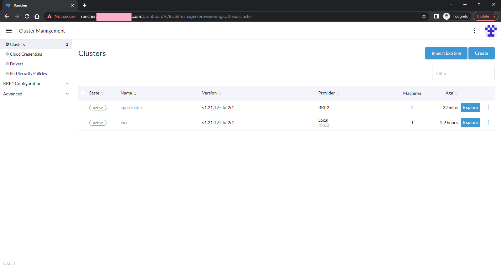
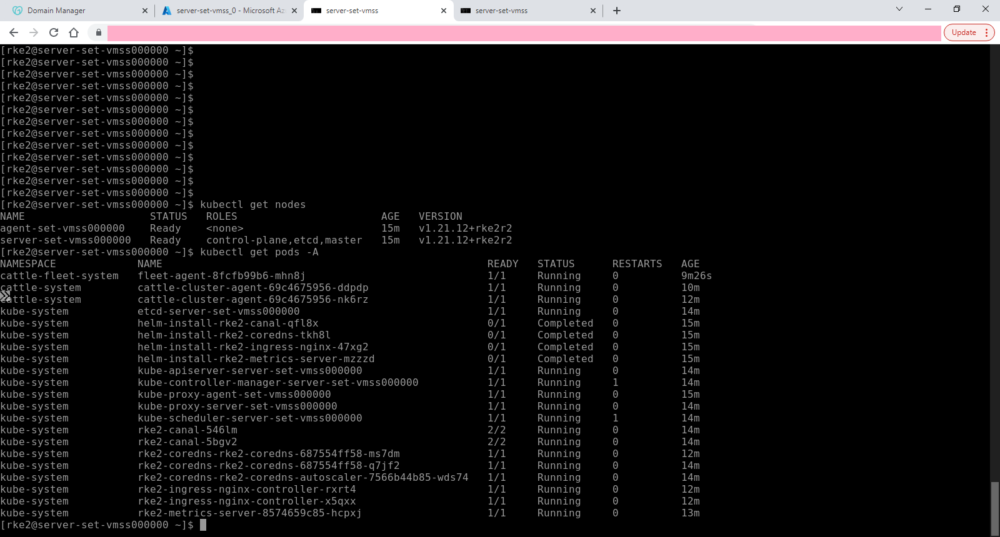
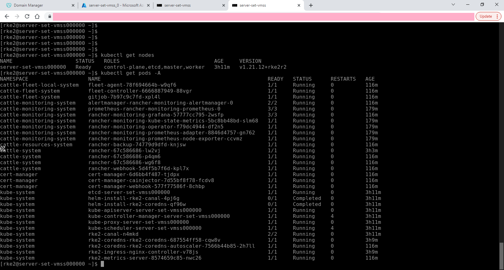
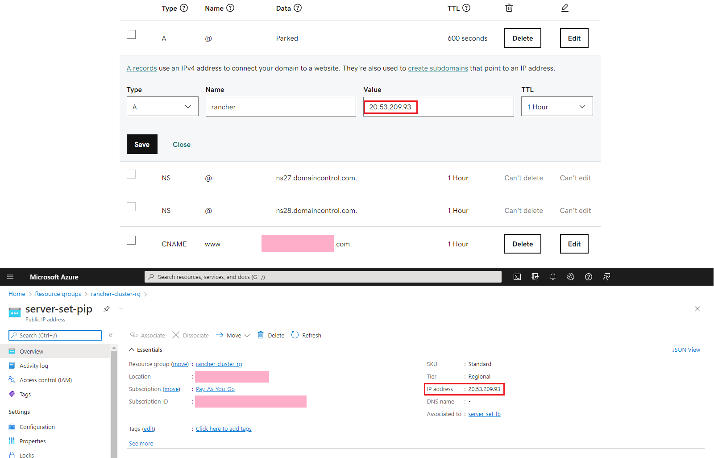

# Terraform RKE2 Azure Cluster

## Summary

This Terraform project is designed to deploy Azure cloud native Rancher and general use RKE2 clusters. That is, not using the AKS offering.

  

After deployment, a fully functional Rancher portal and cluster are provisioned.

This module is designed to be "lean-and-mean" and have minimal dependencies. The two Terraform provider dependencies are:
* azurerm
* rancher2

## Usage

Please run the Terraform commands from a console and not from the Azure Cloudshell.

Initialise terraform as usual:
```
terraform init
```

### Deploy a Rancher (web portal) cluster

The following command may be helpful to deploy a cluster with Rancher:
```
terraform apply -var-file vars/rancher/variables.tfvars
```

### Deploy an empty cluster (for any application)

The following command may be helpful to deploy an empty cluster and join an exisitng Rancher cluster:
```
terraform apply -var-file vars/empty/variables.tfvars
```

### Access

To access a cluster, use the provisioned Bastion host within the same network to connect to the server and agent network elements.
The username for these network elements is "rke2", and the connection key named "node-key" is stored in the key vault in the same resource group. This makes connecting to the cluster very easy via the Azure portal web interface.

### Setting up Rancher web address

To access the Rancher management web interface, set the public IP address of the Rancher cluster as an A-Record with the DNS provider.



### Helpful commands

To set and use the Kubernetes configuration file:
```
export KUBECONFIG=/etc/rancher/rke2/rke2.yaml
export PATH=$PATH:/var/lib/rancher/rke2/bin
```

To fetch the initial Rancher password after installation use the following command:
```
kubectl get secret --namespace cattle-system bootstrap-secret -o go-template='{{ .data.bootstrapPassword|base64decode}}{{ "\n" }}'
```

The bootstrapped password is "admin"

To check the Kubernetes nodes:
```
kubectl get nodes
```

To check the Kubernetes pods:
```
kubectl get pods -A
```

To follow the installation of the network elements use the following commands:

```
tail -f /usr/local/rke2-download.log
tail -f /usr/local/rke2-setup.log
```
